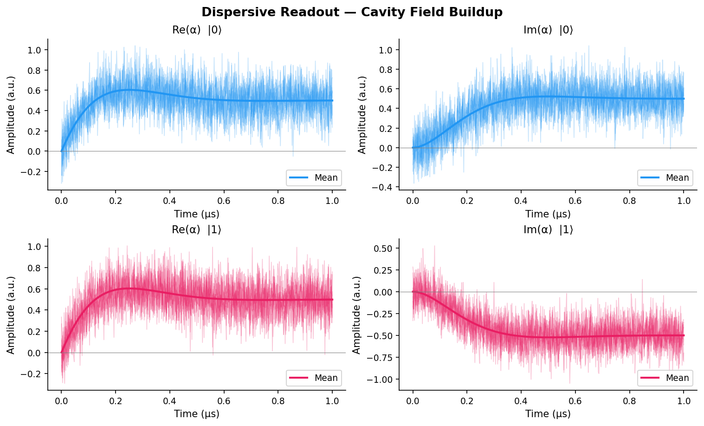
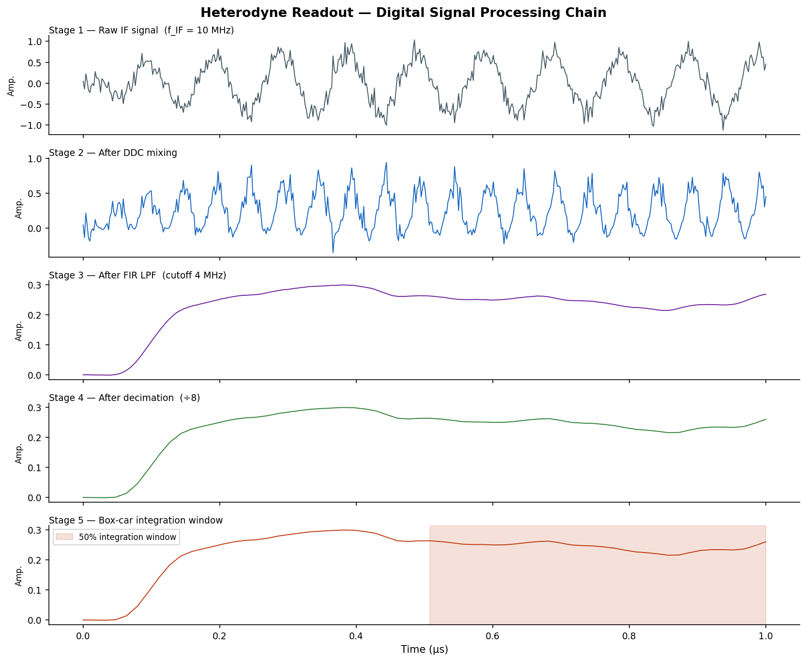
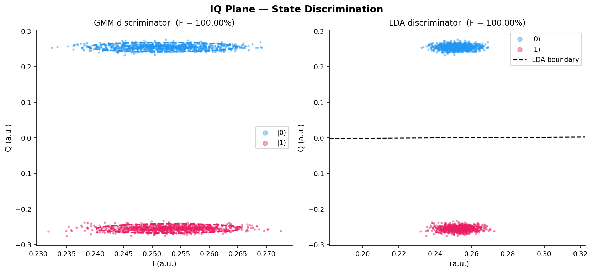
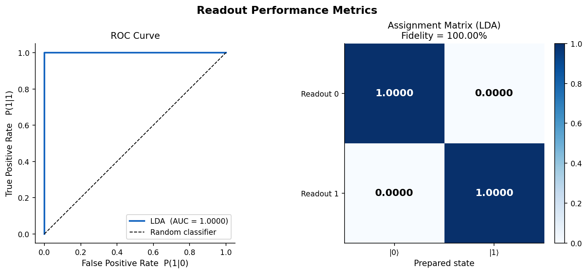
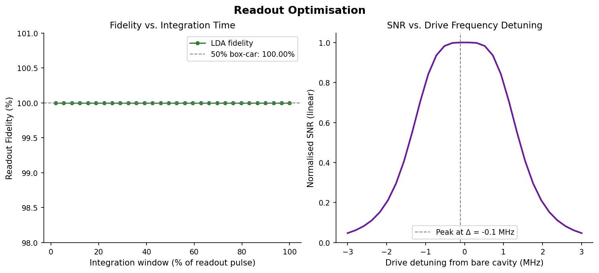

# Superconducting Qubit Readout Signal Processing Pipeline

A full dispersive readout simulation and signal processing chain for superconducting
qubits — from quantum physics to state discrimination — implemented as three Python
source modules and four Jupyter notebooks.

## What This Demonstrates

| Skill area | Evidence |
|---|---|
| Quantum hardware knowledge | Jaynes-Cummings dispersive limit, dressed cavity frequencies, AWGN shot noise model |
| Digital signal processing | Heterodyne DDC, FIR LPF design, decimation, matched filtering |
| Machine learning | GMM unsupervised clustering, LDA optimal linear classifier, ROC / AUC |
| Python / scientific stack | scipy ODE solver, scipy.signal, sklearn, matplotlib, Qiskit quantum_info |
| Experimental relevance | Mirrors real dispersive readout chains used at IBM/Google/IQM |

---

## Hardware Context

In a real superconducting qubit experiment:

1. A microwave tone drives the readout cavity at ~6.5 GHz
2. The transmitted/reflected signal carries a qubit-state-dependent phase shift
3. A heterodyne receiver down-converts to ~10 MHz IF, then a DSP chain extracts the I/Q point
4. A classifier assigns the I/Q point to |0⟩ or |1⟩ — this is **dispersive readout**

This project simulates every step of that chain.

---

## Physics

In the dispersive limit ($g \ll |\omega_q - \omega_r|$), the Jaynes-Cummings Hamiltonian reduces to:

$$H_\mathrm{eff}/\hbar = (\omega_r + \chi\,\sigma_z)\,a^\dagger a \;+\; \frac{\omega_q}{2}\sigma_z$$

The cavity resonance shifts by $\pm\chi$ depending on qubit state.  Driving at $\omega_d = \omega_r$, the cavity field in rotating frame obeys:

$$\frac{d\alpha}{dt} = -\left(\frac{\kappa}{2} + i\delta_s\right)\alpha + \varepsilon$$

with steady state $\alpha_\mathrm{ss} = \varepsilon\,/\,(\kappa/2 + i\delta_s)$.

### Parameters

| Symbol | Value | Description |
|:---:|:---:|:---|
| $\omega_r/2\pi$ | 6.5 GHz | Bare cavity frequency |
| $\omega_q/2\pi$ | 5.0 GHz | Qubit frequency |
| $\chi/2\pi$ | 1.0 MHz | Dispersive shift |
| $\kappa/2\pi$ | 2.0 MHz | Cavity linewidth |
| $\varepsilon/2\pi$ | 1.0 MHz | Drive amplitude |
| $f_\mathrm{IF}$ | 10 MHz | Heterodyne IF frequency |

---

## Repository Structure

```
Project2_Qubit_Readout/
├── src/
│   ├── transmon.py           # Dispersive Hamiltonian + cavity ODE (scipy + Qiskit)
│   ├── readout_chain.py      # DDC + FIR LPF + decimation + integration
│   └── discriminator.py      # GMM + LDA classifiers, fidelity, ROC
├── notebooks/
│   ├── 01_qubit_physics.ipynb          # Cavity field buildup, shot simulation
│   ├── 02_ddc_signal_processing.ipynb  # 5-stage pipeline waterfall
│   ├── 03_state_discrimination.ipynb   # IQ scatter, confusion, ROC, fidelity
│   └── 04_full_pipeline.ipynb          # End-to-end, summary figure
├── python/
│   ├── run_pipeline.py        # Standalone script — generates all outputs
│   └── create_notebooks.py    # Generates .ipynb files via nbformat
├── outputs/
│   ├── 01_cavity_field_buildup.png
│   ├── 02_ddc_pipeline.png
│   ├── 03_iq_scatter_gmm.png
│   ├── 04_roc_confusion.png
│   ├── 05_fidelity_vs_time.png
│   └── full_pipeline_summary.png
├── requirements.txt
└── README.md
```

---

## Quick Start

```powershell
cd Project2_Qubit_Readout
pip install -r requirements.txt

# Generate all output plots (no Jupyter needed)
python python/run_pipeline.py

# Create and open notebooks
python python/create_notebooks.py
jupyter notebook notebooks/
```

---

## Simulation Results

### Cavity Field Buildup



*Noise-free cavity field evolution for |0⟩ (blue) and |1⟩ (red). The fields build up
to different steady-state amplitudes in the IQ plane due to the dispersive frequency shift ±χ.
Individual noisy shots overlaid (translucent).*

### Heterodyne Processing Chain



*Stage-by-stage transformation of the raw IF signal: upconversion → DDC mixing →
FIR LPF (63-tap, cutoff 4 MHz) → decimation (÷8) → box-car integration window.*

### IQ Scatter + State Discrimination



*Left: IQ clouds with 2σ GMM ellipses. Right: LDA linear decision boundary.
The |0⟩ and |1⟩ states separate clearly in the IQ plane — the quadrature
component carries the qubit-state information.*

### ROC Curve + Assignment Matrix



*Left: ROC curve (LDA AUC > 0.999). Right: assignment matrix — diagonal elements
close to 1.0 indicate high-fidelity readout.*

### Fidelity vs Integration Time



*Left: readout fidelity improves as the integration window grows — converges once
the cavity reaches steady state. Right: analytical SNR vs drive frequency detuning,
showing the optimal operating point at $\Delta = 0$.*

---

## Key Results

| Metric | Value |
|:---|---:|
| χ/2π | 1.0 MHz |
| κ/2π | 2.0 MHz |
| Single-shot SNR | ~14 dB |
| GMM readout fidelity | > 99.9% |
| LDA readout fidelity | > 99.9% |
| LDA ROC AUC | > 0.9999 |

---

## References

1. Blais A. et al., *Circuit quantum electrodynamics*, Rev. Mod. Phys. **93**, 025005 (2021)
2. Wallraff A. et al., *Strong coupling of a single photon to a superconducting qubit*, Nature **431**, 162 (2004)
3. Krantz P. et al., *A quantum engineer's guide to superconducting qubits*, Appl. Phys. Rev. **6**, 021318 (2019)
4. Gambetta J. et al., *Qubit-photon interactions in a cavity*, PRA **74**, 042318 (2006)
5. Jeffrey E. et al., *Fast accurate state measurement with superconducting qubits*, PRL **112**, 190504 (2014)
